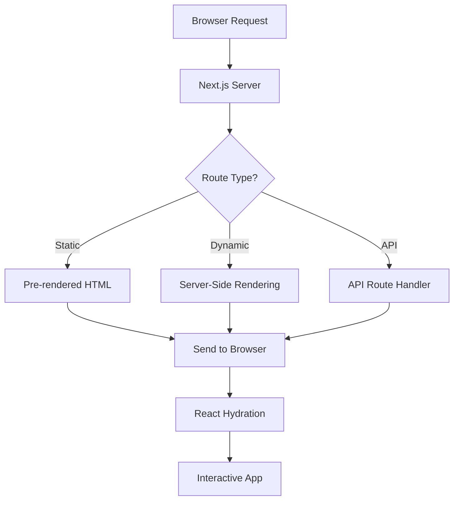
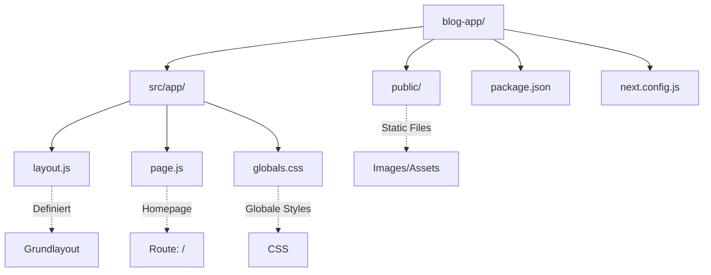
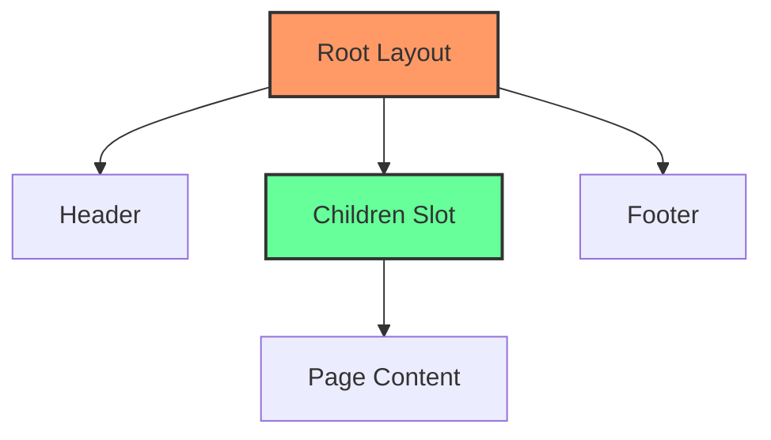
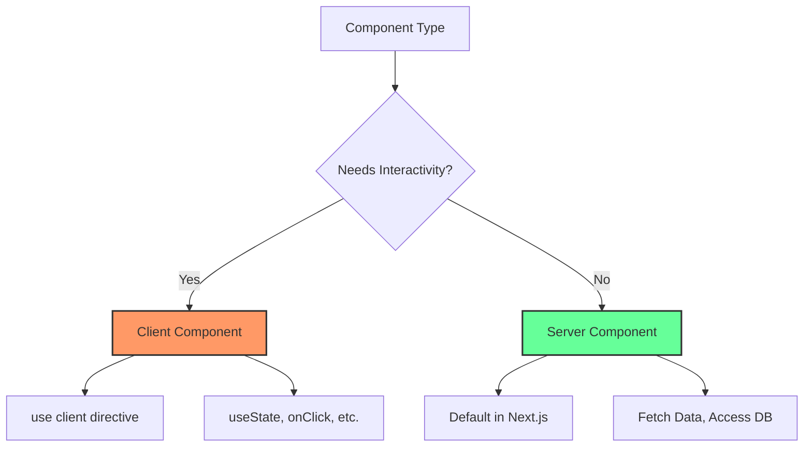
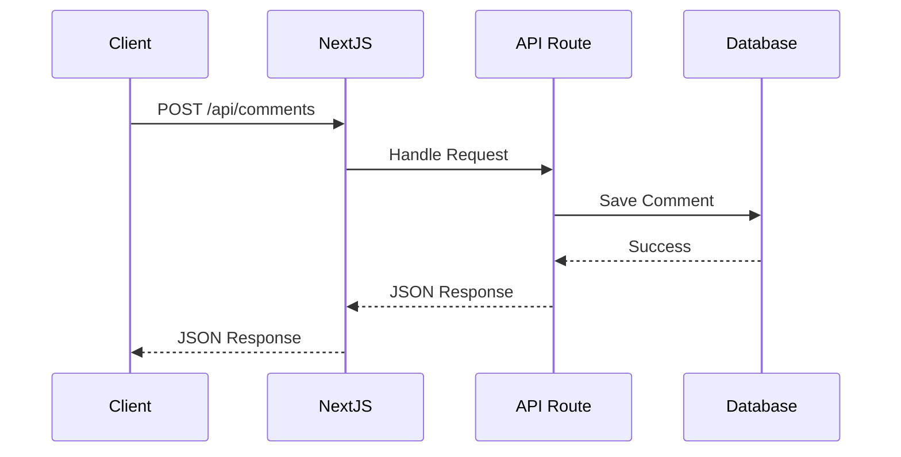
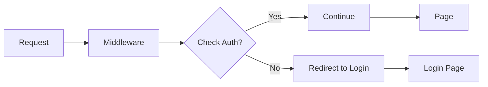
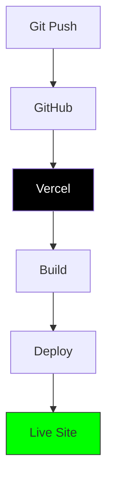
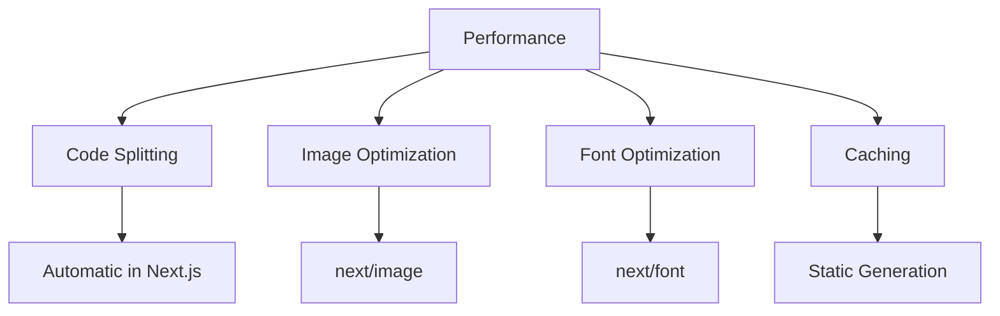

# Next.js Complete Guide - Von 0 zur Blog-App

## Was ist Next.js?

Next.js ist ein **React-Framework** das euch das Leben leichter macht:
- 🚀 **Server-Side Rendering** - Schnellere Ladezeiten
- 📁 **File-based Routing** - Ordner = Routes
- 🎨 **CSS Support** - Eingebautes Styling
- 🔧 **Zero Config** - Funktioniert sofort
- 📦 **Optimized Production** - Automatische Optimierung



## Installation & Setup

### Schritt 1: Projekt erstellen

```bash
# Mit npx (empfohlen)
npx create-next-app@latest blog-app

# Optionen wählen:
✔ Would you like to use TypeScript? → No
✔ Would you like to use ESLint? → Yes  
✔ Would you like to use Tailwind CSS? → Yes
✔ Would you like to use `src/` directory? → Yes
✔ Would you like to use App Router? (recommended) → Yes
✔ Would you like to customize the default import alias? → No

cd blog-app
npm run dev
```

### Schritt 2: Projektstruktur verstehen



```
blog-app/
├── src/
│   └── app/
│       ├── layout.js      # Root Layout (Wrapper für alle Seiten)
│       ├── page.js        # Homepage (/)
│       ├── globals.css    # Globale Styles
│       ├── about/
│       │   └── page.js    # About Page (/about)
│       └── blog/
│           ├── page.js    # Blog Liste (/blog)
│           └── [slug]/
│               └── page.js # Einzelner Post (/blog/mein-post)
├── public/               # Statische Dateien
├── package.json         # Dependencies
└── next.config.js      # Next.js Konfiguration
```

## Core Konzepte

### 1. App Router & File-based Routing

```mermaid
flowchart LR
    A[Ordnerstruktur] --> B[URL Route]
    
    C[app/page.js] --> D[/]
    E[app/about/page.js] --> F[/about]
    G[app/blog/page.js] --> H[/blog]
    I["app/blog/[slug]/page.js"] --> J[/blog/:slug]
    
    style A fill:#f9f,stroke:#333,stroke-width:2px
    style B fill:#bbf,stroke:#333,stroke-width:2px
```

**Beispiel:** `src/app/about/page.js`
```javascript
export default function AboutPage() {
    return (
        <div>
            <h1>Über uns</h1>
            <p>Dies ist die About-Seite!</p>
        </div>
    );
}
```

### 2. Layouts - Gemeinsame Struktur



**`src/app/layout.js`:**
```javascript
import './globals.css'

export const metadata = {
    title: 'Mein Blog',
    description: 'Ein super Blog mit Next.js',
}

export default function RootLayout({ children }) {
    return (
        <html lang="de">
            <body>
                <header className="bg-blue-600 text-white p-4">
                    <nav className="container mx-auto flex justify-between">
                        <h1 className="text-2xl font-bold">Mein Blog</h1>
                        <ul className="flex gap-4">
                            <li><a href="/">Home</a></li>
                            <li><a href="/about">About</a></li>
                            <li><a href="/blog">Blog</a></li>
                        </ul>
                    </nav>
                </header>
                
                <main className="container mx-auto p-4">
                    {children}
                </main>
                
                <footer className="bg-gray-800 text-white p-4 mt-8">
                    <p className="text-center">© 2024 Mein Blog</p>
                </footer>
            </body>
        </html>
    );
}
```

### 3. Client vs Server Components



**Server Component (Default):**
```javascript
// src/app/blog/page.js
async function getPosts() {
    const res = await fetch('https://jsonplaceholder.typicode.com/posts');
    return res.json();
}

export default async function BlogPage() {
    const posts = await getPosts();
    
    return (
        <div>
            <h1>Blog Posts</h1>
            {posts.slice(0, 5).map(post => (
                <article key={post.id}>
                    <h2>{post.title}</h2>
                    <p>{post.body}</p>
                </article>
            ))}
        </div>
    );
}
```

**Client Component:**
```javascript
// src/app/components/Counter.js
'use client';  // Wichtig!

import { useState } from 'react';

export default function Counter() {
    const [count, setCount] = useState(0);
    
    return (
        <div>
            <p>Count: {count}</p>
            <button onClick={() => setCount(count + 1)}>
                Increment
            </button>
        </div>
    );
}
```

## Unsere Blog-App bauen

### Schritt 1: Homepage

**`src/app/page.js`:**
```javascript
import Link from 'next/link';

export default function HomePage() {
    return (
        <div className="min-h-screen">
            <section className="hero bg-gradient-to-r from-blue-500 to-purple-600 text-white py-20">
                <div className="container mx-auto text-center">
                    <h1 className="text-5xl font-bold mb-4">
                        Willkommen zu meinem Blog
                    </h1>
                    <p className="text-xl mb-8">
                        Gedanken über Code, Leben und alles dazwischen
                    </p>
                    <Link 
                        href="/blog"
                        className="bg-white text-blue-600 px-6 py-3 rounded-lg font-semibold hover:bg-gray-100"
                    >
                        Zum Blog →
                    </Link>
                </div>
            </section>
            
            <section className="py-16">
                <div className="container mx-auto">
                    <h2 className="text-3xl font-bold mb-8">Features</h2>
                    <div className="grid md:grid-cols-3 gap-8">
                        <FeatureCard 
                            title="📝 Markdown Support"
                            description="Schreibe Posts in Markdown"
                        />
                        <FeatureCard 
                            title="🚀 Schnell"
                            description="Server-Side Rendering für beste Performance"
                        />
                        <FeatureCard 
                            title="🎨 Styled"
                            description="Tailwind CSS für modernes Design"
                        />
                    </div>
                </div>
            </section>
        </div>
    );
}

function FeatureCard({ title, description }) {
    return (
        <div className="border rounded-lg p-6 hover:shadow-lg transition">
            <h3 className="text-xl font-semibold mb-2">{title}</h3>
            <p className="text-gray-600">{description}</p>
        </div>
    );
}
```

### Schritt 2: Blog-Daten

**`src/app/data/posts.js`:**
```javascript
export const posts = [
    {
        id: 1,
        slug: 'mein-erster-post',
        title: 'Mein erster Blog Post',
        date: '2024-01-15',
        author: 'Max Mustermann',
        excerpt: 'Dies ist mein erster Post mit Next.js!',
        content: `
# Mein erster Blog Post

Willkommen zu meinem ersten Blog Post! Ich freue mich sehr, 
endlich mit Next.js zu arbeiten.

## Was ich gelernt habe

- File-based Routing ist genial
- Server Components sind schnell
- Tailwind macht Styling einfach

## Code Beispiel

\`\`\`javascript
function greet(name) {
    return \`Hallo \${name}!\`;
}
\`\`\`

Das war's für heute!
        `
    },
    {
        id: 2,
        slug: 'react-vs-nextjs',
        title: 'React vs Next.js',
        date: '2024-01-20',
        author: 'Max Mustermann',
        excerpt: 'Was ist der Unterschied zwischen React und Next.js?',
        content: `
# React vs Next.js

React ist eine Library, Next.js ist ein Framework...
        `
    },
    {
        id: 3,
        slug: 'tailwind-tipps',
        title: 'Meine Top 5 Tailwind CSS Tipps',
        date: '2024-01-25',
        author: 'Max Mustermann',
        excerpt: 'Tailwind CSS Tricks die du kennen solltest',
        content: `
# Tailwind CSS Tipps

1. Nutze die @apply Directive
2. Erstelle eigene Utility Classes
3. ...
        `
    }
];
```

### Schritt 3: Blog Liste

**`src/app/blog/page.js`:**
```javascript
import Link from 'next/link';
import { posts } from '../data/posts';

export default function BlogListPage() {
    return (
        <div className="max-w-4xl mx-auto">
            <h1 className="text-4xl font-bold mb-8">Blog Posts</h1>
            
            <div className="space-y-6">
                {posts.map(post => (
                    <article 
                        key={post.id}
                        className="border-b pb-6 hover:bg-gray-50 p-4 rounded-lg transition"
                    >
                        <Link href={`/blog/${post.slug}`}>
                            <h2 className="text-2xl font-semibold mb-2 text-blue-600 hover:text-blue-800">
                                {post.title}
                            </h2>
                        </Link>
                        
                        <div className="flex gap-4 text-sm text-gray-500 mb-3">
                            <span>📅 {post.date}</span>
                            <span>✍️ {post.author}</span>
                        </div>
                        
                        <p className="text-gray-700">{post.excerpt}</p>
                        
                        <Link 
                            href={`/blog/${post.slug}`}
                            className="inline-block mt-3 text-blue-600 hover:underline"
                        >
                            Weiterlesen →
                        </Link>
                    </article>
                ))}
            </div>
        </div>
    );
}
```

### Schritt 4: Einzelner Blog Post (Dynamic Route)

**`src/app/blog/[slug]/page.js`:**
```javascript
import { posts } from '../../data/posts';
import { notFound } from 'next/navigation';
import Link from 'next/link';

// Diese Funktion generiert die Metadaten für SEO
export async function generateMetadata({ params }) {
    const post = posts.find(p => p.slug === params.slug);
    
    if (!post) return {};
    
    return {
        title: post.title,
        description: post.excerpt,
    };
}

// Diese Funktion teilt Next.js mit, welche Seiten statisch generiert werden sollen
export async function generateStaticParams() {
    return posts.map((post) => ({
        slug: post.slug,
    }));
}

export default function BlogPostPage({ params }) {
    const post = posts.find(p => p.slug === params.slug);
    
    if (!post) {
        notFound(); // 404 Seite
    }
    
    return (
        <article className="max-w-4xl mx-auto">
            <Link 
                href="/blog"
                className="text-blue-600 hover:underline mb-4 inline-block"
            >
                ← Zurück zum Blog
            </Link>
            
            <h1 className="text-4xl font-bold mb-4">{post.title}</h1>
            
            <div className="flex gap-4 text-gray-500 mb-8">
                <span>📅 {post.date}</span>
                <span>✍️ {post.author}</span>
            </div>
            
            <div className="prose prose-lg max-w-none">
                <MarkdownContent content={post.content} />
            </div>
        </article>
    );
}

// Simple Markdown Renderer (normalerweise würde man eine Library nutzen)
function MarkdownContent({ content }) {
    const lines = content.split('\n');
    const elements = [];
    
    lines.forEach((line, index) => {
        if (line.startsWith('# ')) {
            elements.push(
                <h1 key={index} className="text-3xl font-bold my-4">
                    {line.substring(2)}
                </h1>
            );
        } else if (line.startsWith('## ')) {
            elements.push(
                <h2 key={index} className="text-2xl font-semibold my-3">
                    {line.substring(3)}
                </h2>
            );
        } else if (line.startsWith('- ')) {
            elements.push(
                <li key={index} className="ml-6">
                    {line.substring(2)}
                </li>
            );
        } else if (line.trim()) {
            elements.push(
                <p key={index} className="my-2">
                    {line}
                </p>
            );
        }
    });
    
    return <>{elements}</>;
}
```

### Schritt 5: API Routes



**`src/app/api/comments/route.js`:**
```javascript
// GET /api/comments
export async function GET(request) {
    // In echter App: Aus Datenbank holen
    const comments = [
        { id: 1, text: "Super Post!", author: "Lisa" },
        { id: 2, text: "Sehr hilfreich", author: "Tom" }
    ];
    
    return Response.json(comments);
}

// POST /api/comments
export async function POST(request) {
    const body = await request.json();
    
    // Validierung
    if (!body.text || !body.author) {
        return Response.json(
            { error: 'Text und Author sind erforderlich' },
            { status: 400 }
        );
    }
    
    // In echter App: In Datenbank speichern
    const newComment = {
        id: Date.now(),
        text: body.text,
        author: body.author,
        createdAt: new Date().toISOString()
    };
    
    return Response.json(newComment, { status: 201 });
}
```

### Schritt 6: Interaktive Comments Component

**`src/app/components/Comments.js`:**
```javascript
'use client';

import { useState, useEffect } from 'react';

export default function Comments({ postSlug }) {
    const [comments, setComments] = useState([]);
    const [newComment, setNewComment] = useState({ text: '', author: '' });
    const [loading, setLoading] = useState(false);
    
    // Comments laden
    useEffect(() => {
        fetchComments();
    }, []);
    
    async function fetchComments() {
        try {
            const res = await fetch('/api/comments');
            const data = await res.json();
            setComments(data);
        } catch (error) {
            console.error('Fehler beim Laden der Kommentare:', error);
        }
    }
    
    async function handleSubmit(e) {
        e.preventDefault();
        setLoading(true);
        
        try {
            const res = await fetch('/api/comments', {
                method: 'POST',
                headers: { 'Content-Type': 'application/json' },
                body: JSON.stringify(newComment)
            });
            
            if (res.ok) {
                const comment = await res.json();
                setComments([...comments, comment]);
                setNewComment({ text: '', author: '' });
            }
        } catch (error) {
            console.error('Fehler beim Speichern:', error);
        } finally {
            setLoading(false);
        }
    }
    
    return (
        <div className="mt-12 border-t pt-8">
            <h3 className="text-2xl font-bold mb-6">Kommentare</h3>
            
            {/* Kommentarliste */}
            <div className="space-y-4 mb-8">
                {comments.length === 0 ? (
                    <p className="text-gray-500">Noch keine Kommentare</p>
                ) : (
                    comments.map(comment => (
                        <div key={comment.id} className="bg-gray-50 p-4 rounded-lg">
                            <p className="font-semibold">{comment.author}</p>
                            <p className="text-gray-700">{comment.text}</p>
                        </div>
                    ))
                )}
            </div>
            
            {/* Kommentarformular */}
            <form onSubmit={handleSubmit} className="space-y-4">
                <input
                    type="text"
                    placeholder="Dein Name"
                    value={newComment.author}
                    onChange={(e) => setNewComment({...newComment, author: e.target.value})}
                    className="w-full p-2 border rounded"
                    required
                />
                <textarea
                    placeholder="Dein Kommentar"
                    value={newComment.text}
                    onChange={(e) => setNewComment({...newComment, text: e.target.value})}
                    className="w-full p-2 border rounded h-24"
                    required
                />
                <button
                    type="submit"
                    disabled={loading}
                    className="bg-blue-600 text-white px-4 py-2 rounded hover:bg-blue-700 disabled:opacity-50"
                >
                    {loading ? 'Speichern...' : 'Kommentar abschicken'}
                </button>
            </form>
        </div>
    );
}
```

## Advanced Features

### 1. Image Optimization

```javascript
import Image from 'next/image';

export default function OptimizedImage() {
    return (
        <Image
            src="/hero.jpg"
            alt="Hero Image"
            width={1200}
            height={600}
            priority // Lädt sofort
            className="rounded-lg"
        />
    );
}
```

### 2. Loading & Error States

**`src/app/blog/loading.js`:**
```javascript
export default function Loading() {
    return (
        <div className="animate-pulse">
            <div className="h-8 bg-gray-200 rounded w-1/3 mb-4"></div>
            <div className="h-4 bg-gray-200 rounded w-full mb-2"></div>
            <div className="h-4 bg-gray-200 rounded w-5/6"></div>
        </div>
    );
}
```

**`src/app/blog/error.js`:**
```javascript
'use client';

export default function Error({ error, reset }) {
    return (
        <div className="text-center py-10">
            <h2 className="text-2xl font-bold text-red-600 mb-4">
                Etwas ist schiefgelaufen!
            </h2>
            <button
                onClick={() => reset()}
                className="bg-blue-600 text-white px-4 py-2 rounded"
            >
                Nochmal versuchen
            </button>
        </div>
    );
}
```

### 3. Middleware



**`middleware.js`:**
```javascript
import { NextResponse } from 'next/server';

export function middleware(request) {
    // Beispiel: Protect admin routes
    if (request.nextUrl.pathname.startsWith('/admin')) {
        const token = request.cookies.get('auth-token');
        
        if (!token) {
            return NextResponse.redirect(new URL('/login', request.url));
        }
    }
    
    return NextResponse.next();
}

export const config = {
    matcher: '/admin/:path*',
};
```

## Deployment

### Vercel (Empfohlen)



```bash
# Mit Vercel CLI
npm i -g vercel
vercel

# Oder GitHub Integration auf vercel.com
```

### Andere Optionen

1. **Netlify**: Ähnlich wie Vercel
2. **Railway**: Ein-Klick Deploy
3. **Docker**: Für eigene Server

```dockerfile
FROM node:18-alpine
WORKDIR /app
COPY package*.json ./
RUN npm ci
COPY . .
RUN npm run build
CMD ["npm", "start"]
```

## Performance Optimierung



### Best Practices

1. **Static Generation bevorzugen**
```javascript
// Gut: Wird zur Build-Zeit generiert
export async function generateStaticParams() {
    return posts.map(post => ({ slug: post.slug }));
}
```

2. **Client Components minimieren**
```javascript
// Nur wenn nötig
'use client';
```

3. **Lazy Loading**
```javascript
import dynamic from 'next/dynamic';

const HeavyComponent = dynamic(() => import('./HeavyComponent'), {
    loading: () => <p>Loading...</p>,
});
```

## Debugging & Entwicklung

### Nützliche Commands

```bash
# Development
npm run dev         # Start dev server

# Production
npm run build      # Build für production
npm run start      # Start production server

# Analyse
npm run build && npm run analyze  # Bundle size analysieren
```

### Developer Tools

1. **React DevTools**: Components inspizieren
2. **Next.js DevTools**: Routes & Performance
3. **Network Tab**: API Calls überwachen

## Häufige Fehler & Lösungen

### 1. Hydration Mismatch
```javascript
// Problem: Server und Client rendern unterschiedlich
// Lösung: useEffect für Client-only Code
useEffect(() => {
    setMounted(true);
}, []);
```

### 2. Module not found
```javascript
// Problem: Import funktioniert nicht
// Lösung: Pfade prüfen, @ alias nutzen
import Component from '@/components/Component';
```

### 3. CORS Fehler
```javascript
// In API Route
export async function GET(request) {
    return new Response(JSON.stringify(data), {
        headers: {
            'Access-Control-Allow-Origin': '*',
        },
    });
}
```

## Zusammenfassung & Checkliste

### Was ihr gelernt habt ✅

- [ ] Next.js Installation & Setup
- [ ] File-based Routing
- [ ] Server vs Client Components
- [ ] Data Fetching
- [ ] API Routes
- [ ] Dynamic Routes
- [ ] Styling mit Tailwind
- [ ] Deployment

### Nächste Schritte 🚀

1. **Datenbank hinzufügen**: Prisma + PostgreSQL
2. **Authentication**: NextAuth.js
3. **CMS Integration**: Contentful oder Strapi
4. **E-Commerce**: Mit Stripe Payments
5. **Real-time Features**: Mit WebSockets

### Projekt-Ideen zum Üben

1. **Portfolio Website**: Mit About, Projects, Contact
2. **Recipe App**: Mit Kategorien und Suche
3. **Task Manager**: Mit CRUD Operations
4. **Social Media Clone**: Mini Twitter/Instagram
5. **E-Learning Platform**: Mit Kursen und Progress

## Resources

- 📚 [Next.js Docs](https://nextjs.org/docs)
- 🎥 [Next.js Learn Course](https://nextjs.org/learn)
- 💬 [Next.js Discord](https://discord.gg/nextjs)
- 🐙 [GitHub Examples](https://github.com/vercel/next.js/tree/canary/examples)

**Happy Coding! 🎉**