# API unter der Haube - Die technische Seite verstehen 🔧

## Was passiert wirklich bei einem API-Aufruf?

Wenn du eine API aufrufst, passieren viele Dinge im Hintergrund. Lass uns Schritt für Schritt durchgehen, was wirklich abläuft!

```mermaid
sequenceDiagram
    participant C as Client (Browser/App)
    participant D as DNS Server
    participant S as API Server
    participant DB as Datenbank
    
    C->>D: 1. Wo ist api.example.com?
    D->>C: 2. IP: 93.184.216.34
    C->>S: 3. HTTP Request an IP
    S->>DB: 4. Daten abfragen
    DB->>S: 5. Daten zurück
    S->>C: 6. HTTP Response mit JSON
```



## Die Anatomie eines HTTP-Requests 📋

Ein API-Request ist wie ein Brief mit verschiedenen Teilen:

### 1. Die Request-Line (Die Adresse)
```http
GET /api/users/123 HTTP/1.1
```
- **GET** = Die Methode (was willst du tun?)
- **/api/users/123** = Der Pfad (wo?)
- **HTTP/1.1** = Die Version (welche Sprache?)

### 2. Die Headers (Der Briefumschlag)
```http
Host: api.example.com
Authorization: Bearer abc123xyz
Content-Type: application/json
Accept: application/json
User-Agent: Mozilla/5.0
```

### 3. Der Body (Der Briefinhalt)
```json
{
    "name": "Max Mustermann",
    "email": "max@example.com"
}
```

## HTTP-Methoden im Detail 🛠️

```mermaid
graph TD
    A[HTTP Methoden] --> B[GET - Daten holen]
    A --> C[POST - Neu erstellen]
    A --> D[PUT - Komplett ersetzen]
    A --> E[PATCH - Teilweise ändern]
    A --> F[DELETE - Löschen]
    A --> G[HEAD - Nur Headers]
    A --> H[OPTIONS - Was ist möglich?]
    
    style B fill:#90EE90
    style C fill:#87CEEB
    style D fill:#FFB347
    style E fill:#FFB347
    style F fill:#FFB6C1
```



### Praktisches Beispiel: Ein Benutzerprofil

```javascript
// GET - Profil abrufen
fetch('https://api.example.com/users/123', {
    method: 'GET',
    headers: {
        'Authorization': 'Bearer token123'
    }
})

// Response:
{
    "id": 123,
    "name": "Max",
    "email": "max@example.com",
    "created_at": "2024-01-15T10:30:00Z"
}

// PUT - Ganzes Profil ersetzen (ALLE Felder nötig!)
fetch('https://api.example.com/users/123', {
    method: 'PUT',
    headers: {
        'Content-Type': 'application/json',
        'Authorization': 'Bearer token123'
    },
    body: JSON.stringify({
        "name": "Max Mustermann",
        "email": "max.neu@example.com",
        "phone": "+49123456789"  // ALLE Felder müssen dabei sein!
    })
})

// PATCH - Nur Email ändern (nur das was sich ändert!)
fetch('https://api.example.com/users/123', {
    method: 'PATCH',
    headers: {
        'Content-Type': 'application/json',
        'Authorization': 'Bearer token123'
    },
    body: JSON.stringify({
        "email": "max.neu@example.com"  // Nur das Email-Feld
    })
})
```

## REST API Architektur 🏗️

REST (Representational State Transfer) ist wie ein Regelwerk für APIs:

```mermaid
graph LR
    A[REST Prinzipien] --> B[1. Client-Server]
    A --> C[2. Stateless]
    A --> D[3. Cacheable]
    A --> E[4. Uniform Interface]
    A --> F[5. Layered System]
    A --> G[6. Code on Demand]
    
    B --> B1[Trennung von UI und Daten]
    C --> C1[Jeder Request ist unabhängig]
    D --> D1[Responses können gecacht werden]
    E --> E1[Einheitliche URL-Struktur]
    F --> F1[Mehrere Schichten möglich]
    G --> G1[Optional: Code zum Client senden]
```



### RESTful URL-Design

```
# Gut strukturierte REST URLs:
/api/users              # Alle Benutzer
/api/users/123          # Ein bestimmter Benutzer
/api/users/123/posts    # Posts eines Benutzers
/api/posts?author=123   # Posts gefiltert nach Autor

# Schlechte URLs:
/api/getUsers           # Verb in URL (schlecht!)
/api/user_list          # Uneinheitlich
/api/123/user           # Ressource vor ID (verwirrend)
```

## Authentifizierung & Autorisierung 🔐

```mermaid
sequenceDiagram
    participant U as User
    participant C as Client App
    participant A as Auth Server
    participant API as API Server
    
    U->>C: 1. Login mit Username/Password
    C->>A: 2. Sende Credentials
    A->>A: 3. Prüfe Credentials
    A->>C: 4. Sende Token (JWT)
    C->>API: 5. API Request + Token
    API->>API: 6. Validiere Token
    API->>C: 7. Sende Daten
```



### Die 3 häufigsten Auth-Methoden

#### 1. API Keys (Einfach)
```javascript
// Im Query Parameter
fetch('https://api.example.com/data?api_key=abc123')

// Im Header (sicherer!)
fetch('https://api.example.com/data', {
    headers: {
        'X-API-Key': 'abc123'
    }
})
```

#### 2. Bearer Token (JWT)
```javascript
// JWT Token Struktur:
// header.payload.signature
const token = "eyJhbGciOiJIUzI1NiIs...";

fetch('https://api.example.com/data', {
    headers: {
        'Authorization': 'Bearer ' + token
    }
})
```

#### 3. OAuth 2.0 (Komplex aber sicher)
```javascript
// 1. User wird zu Provider weitergeleitet
window.location.href = 'https://auth.provider.com/oauth/authorize?' +
    'client_id=myapp&' +
    'redirect_uri=https://myapp.com/callback&' +
    'response_type=code&' +
    'scope=read:user';

// 2. Nach Login kommt User zurück mit Code
// 3. Code gegen Token tauschen
fetch('https://auth.provider.com/oauth/token', {
    method: 'POST',
    body: JSON.stringify({
        code: authCode,
        client_id: 'myapp',
        client_secret: 'secret',
        grant_type: 'authorization_code'
    })
})
```

## Status Codes verstehen 📊


### Status Code Beispiele mit Bedeutung

```javascript
// 200 OK - Alles gut
{
    "status": 200,
    "data": { "user": "Max" }
}

// 201 Created - Neu erstellt
{
    "status": 201,
    "data": { "id": 456, "created_at": "2024-01-20" },
    "location": "/api/users/456"
}

// 400 Bad Request - Falsche Daten gesendet
{
    "status": 400,
    "error": "Validation failed",
    "details": {
        "email": "Invalid email format"
    }
}

// 401 Unauthorized - Nicht angemeldet
{
    "status": 401,
    "error": "Token expired",
    "message": "Please login again"
}

// 429 Too Many Requests - Rate Limiting
{
    "status": 429,
    "error": "Rate limit exceeded",
    "retry_after": 3600,  // Sekunden
    "limit": "100 requests per hour"
}
```

## Rate Limiting & Throttling ⏱️

APIs schützen sich vor Überlastung:

```javascript
// Headers zeigen Rate Limit Info
fetch('https://api.github.com/users/octocat')
    .then(response => {
        console.log('Limit:', response.headers.get('X-RateLimit-Limit'));
        console.log('Remaining:', response.headers.get('X-RateLimit-Remaining'));
        console.log('Reset:', response.headers.get('X-RateLimit-Reset'));
        return response.json();
    });

// Ausgabe:
// Limit: 60
// Remaining: 58
// Reset: 1642789200 (Unix timestamp)
```

### Rate Limiting Strategien

```mermaid
graph LR
    A[Rate Limiting] --> B[Fixed Window]
    A --> C[Sliding Window]
    A --> D[Token Bucket]
    A --> E[Leaky Bucket]
    
    B --> B1[100 Requests pro Stunde]
    C --> C1[100 Requests in letzten 60 Min]
    D --> D1[Tokens werden aufgefüllt]
    E --> E1[Gleichmäßiger Durchfluss]
```



## CORS - Cross-Origin Resource Sharing 🌐

CORS ist wie ein Türsteher für APIs:

```mermaid
sequenceDiagram
    participant B as Browser
    participant O as Origin (deine-seite.de)
    participant A as API (api.andere-seite.de)
    
    B->>A: 1. OPTIONS Request (Preflight)
    A->>B: 2. Access-Control Headers
    Note over B: 3. Browser prüft Headers
    B->>A: 4. Echter Request (wenn erlaubt)
    A->>B: 5. Response mit Daten
```



### CORS Headers verstehen

```javascript
// Server sendet diese Headers:
Access-Control-Allow-Origin: https://deine-seite.de
Access-Control-Allow-Methods: GET, POST, PUT, DELETE
Access-Control-Allow-Headers: Content-Type, Authorization
Access-Control-Max-Age: 86400

// Oder für alle erlauben (unsicher!):
Access-Control-Allow-Origin: *

// In deinem Frontend-Code:
fetch('https://api.andere-seite.de/data', {
    mode: 'cors',  // CORS-Mode aktivieren
    credentials: 'include',  // Cookies mitsenden
    headers: {
        'Content-Type': 'application/json'
    }
})
```

## Pagination - Große Datenmengen handhaben 📚

```javascript
// Offset-basierte Pagination
GET /api/users?offset=20&limit=10
// Zeige 10 Einträge, überspringe die ersten 20

// Seiten-basierte Pagination  
GET /api/users?page=3&per_page=10
// Zeige Seite 3 mit 10 Einträgen pro Seite

// Cursor-basierte Pagination (beste Performance)
GET /api/users?cursor=eyJpZCI6MTIzfQ&limit=10
// Zeige 10 Einträge nach Cursor-Position

// Response mit Pagination-Info:
{
    "data": [...],
    "pagination": {
        "total": 1000,
        "per_page": 10,
        "current_page": 3,
        "last_page": 100,
        "next_url": "/api/users?page=4",
        "prev_url": "/api/users?page=2"
    }
}
```

## API Versionierung 🔢

```mermaid
graph TD
    A[API Versionierung] --> B[URL Path]
    A --> C[Query Parameter]
    A --> D[Header]
    A --> E[Content Type]
    
    B --> B1[/api/v1/users]
    C --> C1[/api/users?version=1]
    D --> D1[API-Version: 1]
    E --> E1[application/vnd.api+json;version=1]
```

### Beispiele für Versionierung

```javascript
// 1. URL Path (am häufigsten)
fetch('https://api.example.com/v1/users')
fetch('https://api.example.com/v2/users')  // Neue Version

// 2. Header-basiert
fetch('https://api.example.com/users', {
    headers: {
        'API-Version': '2.0'
    }
})

// 3. Accept Header
fetch('https://api.example.com/users', {
    headers: {
        'Accept': 'application/vnd.example.v2+json'
    }
})
```

## WebHooks - Wenn die API dich anruft 📞


### Webhook Implementierung

```javascript
// Webhook registrieren
fetch('https://api.service.com/webhooks', {
    method: 'POST',
    headers: {
        'Authorization': 'Bearer token123',
        'Content-Type': 'application/json'
    },
    body: JSON.stringify({
        url: 'https://meine-app.de/webhook/payment',
        events: ['payment.success', 'payment.failed'],
        secret: 'webhook_secret_123'  // Für Signatur-Prüfung
    })
})

// Webhook empfangen (Node.js/Express Beispiel)
app.post('/webhook/payment', (req, res) => {
    // Signatur prüfen
    const signature = req.headers['x-webhook-signature'];
    const expectedSig = crypto
        .createHmac('sha256', 'webhook_secret_123')
        .update(JSON.stringify(req.body))
        .digest('hex');
    
    if (signature !== expectedSig) {
        return res.status(401).send('Invalid signature');
    }
    
    // Event verarbeiten
    const event = req.body;
    if (event.type === 'payment.success') {
        // Zahlung erfolgreich!
        console.log('Payment received:', event.data.amount);
    }
    
    res.status(200).send('OK');
});
```

## GraphQL vs REST 🤔


### REST vs GraphQL Beispiel

```javascript
// REST - Mehrere Requests nötig
// 1. User holen
fetch('/api/users/123')
    .then(res => res.json())
    .then(user => {
        // 2. Posts des Users holen
        return fetch(`/api/users/123/posts`);
    })
    .then(res => res.json())
    .then(posts => {
        // 3. Kommentare für jeden Post
        // ... noch mehr requests
    });

// GraphQL - Ein Request für alles!
fetch('/graphql', {
    method: 'POST',
    headers: { 'Content-Type': 'application/json' },
    body: JSON.stringify({
        query: `
            query {
                user(id: 123) {
                    name
                    email
                    posts {
                        title
                        comments {
                            text
                            author
                        }
                    }
                }
            }
        `
    })
});
```

## API Testing Tools 🧪

### 1. Mit cURL (Command Line)
```bash
# GET Request
curl https://api.example.com/users

# POST Request mit JSON
curl -X POST https://api.example.com/users \
  -H "Content-Type: application/json" \
  -H "Authorization: Bearer token123" \
  -d '{"name":"Max","email":"max@example.com"}'

# Mit Ausgabe-Formatierung
curl https://api.example.com/users | python -m json.tool
```

### 2. Mit JavaScript/Browser Console
```javascript
// Direkt in der Browser-Konsole testen
async function testAPI() {
    const response = await fetch('https://api.example.com/users');
    const data = await response.json();
    console.table(data);  // Schöne Tabellen-Ausgabe
    return data;
}

testAPI();
```

### 3. Mit Node.js Script
```javascript
// test-api.js
const https = require('https');

function testEndpoint(path) {
    return new Promise((resolve, reject) => {
        const options = {
            hostname: 'api.example.com',
            path: path,
            method: 'GET',
            headers: {
                'Authorization': 'Bearer token123'
            }
        };
        
        const req = https.request(options, (res) => {
            let data = '';
            res.on('data', chunk => data += chunk);
            res.on('end', () => {
                console.log(`\n📍 ${path}`);
                console.log(`Status: ${res.statusCode}`);
                console.log(`Headers:`, res.headers);
                console.log(`Body:`, JSON.parse(data));
                resolve(data);
            });
        });
        
        req.on('error', reject);
        req.end();
    });
}

// Tests ausführen
async function runTests() {
    await testEndpoint('/users');
    await testEndpoint('/users/123');
    await testEndpoint('/posts');
}

runTests();
```

## Performance-Optimierung 🚀

### 1. Caching implementieren
```javascript
// Browser-Cache mit Cache API
const cacheName = 'api-cache-v1';

async function fetchWithCache(url) {
    const cache = await caches.open(cacheName);
    
    // Versuche aus Cache zu laden
    const cachedResponse = await cache.match(url);
    if (cachedResponse) {
        console.log('Aus Cache geladen:', url);
        return cachedResponse.json();
    }
    
    // Nicht im Cache, von API holen
    const response = await fetch(url);
    
    // In Cache speichern für nächstes Mal
    if (response.ok) {
        cache.put(url, response.clone());
    }
    
    return response.json();
}
```

### 2. Request Batching
```javascript
// Mehrere Requests zu einem kombinieren
class APIBatcher {
    constructor() {
        this.queue = [];
        this.timeout = null;
    }
    
    fetch(id) {
        return new Promise((resolve) => {
            this.queue.push({ id, resolve });
            
            // Warte 50ms um weitere Requests zu sammeln
            clearTimeout(this.timeout);
            this.timeout = setTimeout(() => this.flush(), 50);
        });
    }
    
    async flush() {
        if (this.queue.length === 0) return;
        
        const ids = this.queue.map(item => item.id);
        const response = await fetch('/api/users/batch', {
            method: 'POST',
            body: JSON.stringify({ ids })
        });
        
        const data = await response.json();
        
        // Verteile Antworten
        this.queue.forEach(item => {
            item.resolve(data[item.id]);
        });
        
        this.queue = [];
    }
}

const batcher = new APIBatcher();
// Diese werden gebündelt in einem Request
batcher.fetch(1).then(user => console.log(user));
batcher.fetch(2).then(user => console.log(user));
batcher.fetch(3).then(user => console.log(user));
```

### 3. Kompression nutzen
```javascript
// Request mit Kompression
fetch('https://api.example.com/large-data', {
    headers: {
        'Accept-Encoding': 'gzip, deflate, br'
    }
})
.then(response => {
    console.log('Content-Encoding:', response.headers.get('Content-Encoding'));
    return response.json();
});
```

## Fehlerbehandlung Best Practices 🛡️

```javascript
class APIClient {
    constructor(baseURL) {
        this.baseURL = baseURL;
        this.retryCount = 3;
        this.retryDelay = 1000;
    }
    
    async request(endpoint, options = {}) {
        let lastError;
        
        for (let i = 0; i < this.retryCount; i++) {
            try {
                const response = await fetch(this.baseURL + endpoint, {
                    ...options,
                    headers: {
                        'Content-Type': 'application/json',
                        ...options.headers
                    }
                });
                
                // Rate Limit behandeln
                if (response.status === 429) {
                    const retryAfter = response.headers.get('Retry-After');
                    const delay = retryAfter ? parseInt(retryAfter) * 1000 : this.retryDelay * (i + 1);
                    console.log(`Rate limited. Waiting ${delay}ms...`);
                    await this.sleep(delay);
                    continue;
                }
                
                // Server-Fehler mit Retry
                if (response.status >= 500) {
                    lastError = new Error(`Server error: ${response.status}`);
                    await this.sleep(this.retryDelay * (i + 1));
                    continue;
                }
                
                // Client-Fehler ohne Retry
                if (!response.ok) {
                    const error = await response.json();
                    throw new Error(error.message || `HTTP ${response.status}`);
                }
                
                return await response.json();
                
            } catch (error) {
                lastError = error;
                
                // Netzwerkfehler mit Retry
                if (error.name === 'TypeError' && i < this.retryCount - 1) {
                    console.log(`Network error, retry ${i + 1}/${this.retryCount}`);
                    await this.sleep(this.retryDelay * (i + 1));
                    continue;
                }
                
                throw error;
            }
        }
        
        throw lastError;
    }
    
    sleep(ms) {
        return new Promise(resolve => setTimeout(resolve, ms));
    }
}

// Verwendung
const api = new APIClient('https://api.example.com');

api.request('/users/123')
    .then(data => console.log('Success:', data))
    .catch(error => console.error('Final error:', error));
```

## Zusammenfassung 📚

### Die wichtigsten technischen Konzepte:

✅ **HTTP-Protokoll** ist die Grundlage aller Web-APIs

✅ **REST-Prinzipien** sorgen für einheitliche API-Struktur

✅ **Status Codes** kommunizieren den Erfolg/Misserfolg

✅ **Headers** transportieren Metadaten und Auth-Info

✅ **CORS** regelt Cross-Origin-Zugriffe

✅ **Rate Limiting** schützt vor Überlastung

✅ **Caching** verbessert die Performance

✅ **Webhooks** ermöglichen Event-basierte Kommunikation

✅ **Versionierung** erlaubt API-Evolution

✅ **Fehlerbehandlung** macht APIs robust

### Nächste Schritte für API-Profis:

1. **API Design**: OpenAPI/Swagger Spezifikationen lernen
2. **Security**: OAuth 2.0 und JWT im Detail verstehen
3. **Performance**: CDNs und Edge Computing nutzen
4. **Monitoring**: API-Metriken und Logging implementieren
5. **Testing**: Automatisierte API-Tests schreiben
6. **Documentation**: Interactive API Docs erstellen

APIs sind das Rückgrat des modernen Webs - je besser du sie verstehst, desto mächtigere Anwendungen kannst du bauen! 🚀