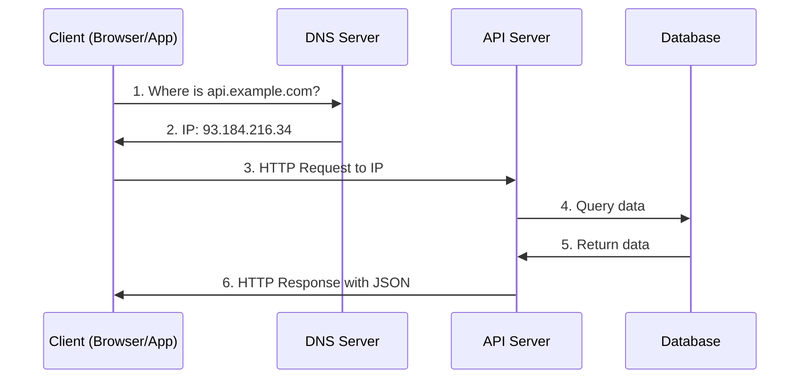
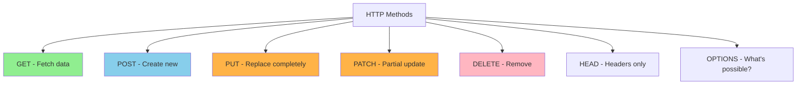
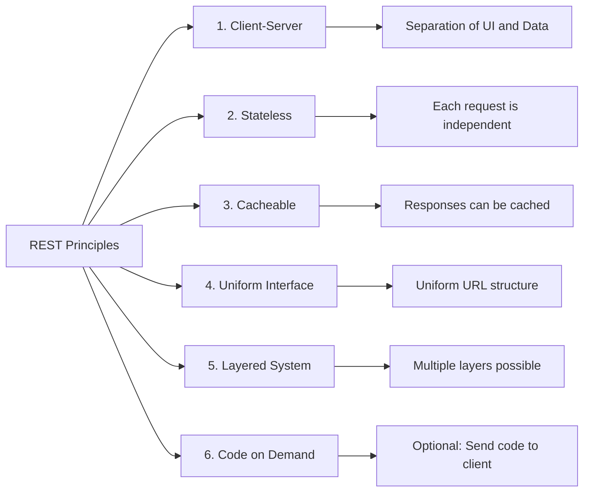
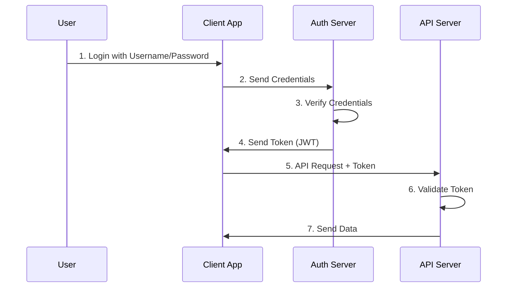
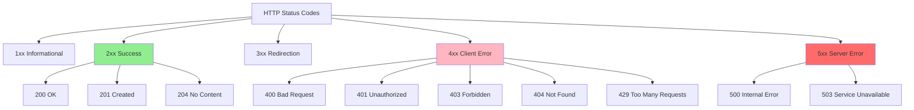
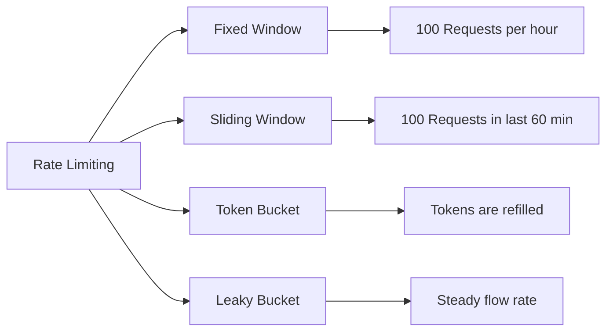
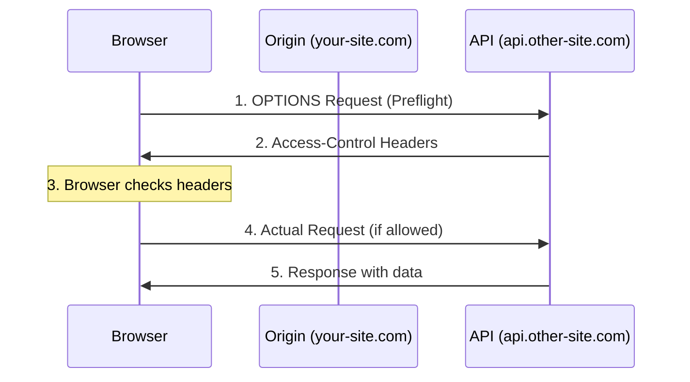
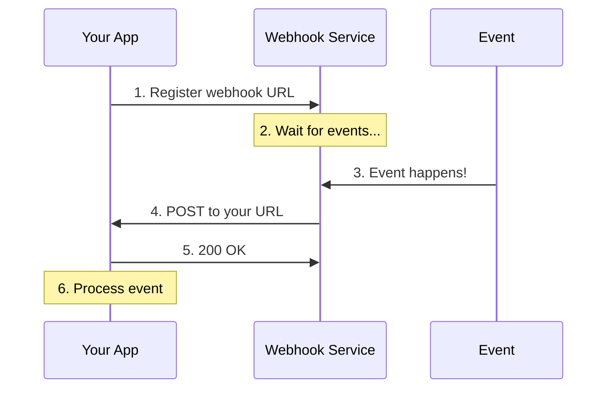
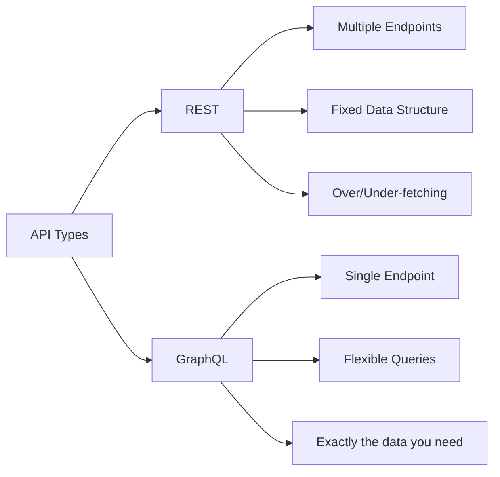

# APIs Under the Hood - Understanding the Technical Side 🔧

## What Really Happens During an API Call?

When you call an API, many things happen behind the scenes. Let's go through step by step what really occurs!



## The Anatomy of an HTTP Request 📋

An API request is like a letter with different parts:

### 1. The Request Line (The Address)
```http
GET /api/users/123 HTTP/1.1
```
- **GET** = The method (what do you want to do?)
- **/api/users/123** = The path (where?)
- **HTTP/1.1** = The version (which language?)

### 2. The Headers (The Envelope)
```http
Host: api.example.com
Authorization: Bearer abc123xyz
Content-Type: application/json
Accept: application/json
User-Agent: Mozilla/5.0
```

### 3. The Body (The Letter Content)
```json
{
    "name": "John Doe",
    "email": "john@example.com"
}
```

## HTTP Methods in Detail 🛠️



### Practical Example: A User Profile

```javascript
// GET - Fetch profile
fetch('https://api.example.com/users/123', {
    method: 'GET',
    headers: {
        'Authorization': 'Bearer token123'
    }
})

// Response:
{
    "id": 123,
    "name": "John",
    "email": "john@example.com",
    "created_at": "2024-01-15T10:30:00Z"
}

// PUT - Replace entire profile (ALL fields required!)
fetch('https://api.example.com/users/123', {
    method: 'PUT',
    headers: {
        'Content-Type': 'application/json',
        'Authorization': 'Bearer token123'
    },
    body: JSON.stringify({
        "name": "John Doe",
        "email": "john.new@example.com",
        "phone": "+1234567890"  // ALL fields must be included!
    })
})

// PATCH - Only change email (only what changes!)
fetch('https://api.example.com/users/123', {
    method: 'PATCH',
    headers: {
        'Content-Type': 'application/json',
        'Authorization': 'Bearer token123'
    },
    body: JSON.stringify({
        "email": "john.new@example.com"  // Only the email field
    })
})
```

## REST API Architecture 🏗️

REST (Representational State Transfer) is like a rulebook for APIs:



### RESTful URL Design

```
# Well-structured REST URLs:
/api/users              # All users
/api/users/123          # A specific user
/api/users/123/posts    # Posts of a user
/api/posts?author=123   # Posts filtered by author

# Bad URLs:
/api/getUsers           # Verb in URL (bad!)
/api/user_list          # Inconsistent
/api/123/user           # Resource before ID (confusing)
```

## Authentication & Authorization 🔐



### The 3 Most Common Auth Methods

#### 1. API Keys (Simple)
```javascript
// In query parameter
fetch('https://api.example.com/data?api_key=abc123')

// In header (more secure!)
fetch('https://api.example.com/data', {
    headers: {
        'X-API-Key': 'abc123'
    }
})
```

#### 2. Bearer Token (JWT)
```javascript
// JWT Token Structure:
// header.payload.signature
const token = "eyJhbGciOiJIUzI1NiIs...";

fetch('https://api.example.com/data', {
    headers: {
        'Authorization': 'Bearer ' + token
    }
})
```

#### 3. OAuth 2.0 (Complex but secure)
```javascript
// 1. User is redirected to provider
window.location.href = 'https://auth.provider.com/oauth/authorize?' +
    'client_id=myapp&' +
    'redirect_uri=https://myapp.com/callback&' +
    'response_type=code&' +
    'scope=read:user';

// 2. After login, user returns with code
// 3. Exchange code for token
fetch('https://auth.provider.com/oauth/token', {
    method: 'POST',
    body: JSON.stringify({
        code: authCode,
        client_id: 'myapp',
        client_secret: 'secret',
        grant_type: 'authorization_code'
    })
})
```

## Understanding Status Codes 📊



### Status Code Examples with Meaning

```javascript
// 200 OK - Everything's fine
{
    "status": 200,
    "data": { "user": "John" }
}

// 201 Created - Newly created
{
    "status": 201,
    "data": { "id": 456, "created_at": "2024-01-20" },
    "location": "/api/users/456"
}

// 400 Bad Request - Wrong data sent
{
    "status": 400,
    "error": "Validation failed",
    "details": {
        "email": "Invalid email format"
    }
}

// 401 Unauthorized - Not logged in
{
    "status": 401,
    "error": "Token expired",
    "message": "Please login again"
}

// 429 Too Many Requests - Rate Limiting
{
    "status": 429,
    "error": "Rate limit exceeded",
    "retry_after": 3600,  // seconds
    "limit": "100 requests per hour"
}
```

## Rate Limiting & Throttling ⏱️

APIs protect themselves from overload:

```javascript
// Headers show rate limit info
fetch('https://api.github.com/users/octocat')
    .then(response => {
        console.log('Limit:', response.headers.get('X-RateLimit-Limit'));
        console.log('Remaining:', response.headers.get('X-RateLimit-Remaining'));
        console.log('Reset:', response.headers.get('X-RateLimit-Reset'));
        return response.json();
    });

// Output:
// Limit: 60
// Remaining: 58
// Reset: 1642789200 (Unix timestamp)
```

### Rate Limiting Strategies



## CORS - Cross-Origin Resource Sharing 🌐

CORS is like a bouncer for APIs:



### Understanding CORS Headers

```javascript
// Server sends these headers:
Access-Control-Allow-Origin: https://your-site.com
Access-Control-Allow-Methods: GET, POST, PUT, DELETE
Access-Control-Allow-Headers: Content-Type, Authorization
Access-Control-Max-Age: 86400

// Or allow all (insecure!):
Access-Control-Allow-Origin: *

// In your frontend code:
fetch('https://api.other-site.com/data', {
    mode: 'cors',  // Enable CORS mode
    credentials: 'include',  // Send cookies
    headers: {
        'Content-Type': 'application/json'
    }
})
```

## Pagination - Handling Large Data Sets 📚

```javascript
// Offset-based pagination
GET /api/users?offset=20&limit=10
// Show 10 entries, skip first 20

// Page-based pagination  
GET /api/users?page=3&per_page=10
// Show page 3 with 10 entries per page

// Cursor-based pagination (best performance)
GET /api/users?cursor=eyJpZCI6MTIzfQ&limit=10
// Show 10 entries after cursor position

// Response with pagination info:
{
    "data": [...],
    "pagination": {
        "total": 1000,
        "per_page": 10,
        "current_page": 3,
        "last_page": 100,
        "next_url": "/api/users?page=4",
        "prev_url": "/api/users?page=2"
    }
}
```

## API Versioning 🔢

```mermaid
graph TD
    A[API Versioning] --> B[URL Path]
    A --> C[Query Parameter]
    A --> D[Header]
    A --> E[Content Type]
    
    B --> B1[/api/v1/users]
    C --> C1[/api/users?version=1]
    D --> D1[API-Version: 1]
    E --> E1[application/vnd.api+json;version=1]
```

### Versioning Examples

```javascript
// 1. URL Path (most common)
fetch('https://api.example.com/v1/users')
fetch('https://api.example.com/v2/users')  // New version

// 2. Header-based
fetch('https://api.example.com/users', {
    headers: {
        'API-Version': '2.0'
    }
})

// 3. Accept Header
fetch('https://api.example.com/users', {
    headers: {
        'Accept': 'application/vnd.example.v2+json'
    }
})
```

## WebHooks - When the API Calls You 📞



### Webhook Implementation

```javascript
// Register webhook
fetch('https://api.service.com/webhooks', {
    method: 'POST',
    headers: {
        'Authorization': 'Bearer token123',
        'Content-Type': 'application/json'
    },
    body: JSON.stringify({
        url: 'https://my-app.com/webhook/payment',
        events: ['payment.success', 'payment.failed'],
        secret: 'webhook_secret_123'  // For signature verification
    })
})

// Receive webhook (Node.js/Express example)
app.post('/webhook/payment', (req, res) => {
    // Verify signature
    const signature = req.headers['x-webhook-signature'];
    const expectedSig = crypto
        .createHmac('sha256', 'webhook_secret_123')
        .update(JSON.stringify(req.body))
        .digest('hex');
    
    if (signature !== expectedSig) {
        return res.status(401).send('Invalid signature');
    }
    
    // Process event
    const event = req.body;
    if (event.type === 'payment.success') {
        // Payment successful!
        console.log('Payment received:', event.data.amount);
    }
    
    res.status(200).send('OK');
});
```

## GraphQL vs REST 🤔



### REST vs GraphQL Example

```javascript
// REST - Multiple requests needed
// 1. Get user
fetch('/api/users/123')
    .then(res => res.json())
    .then(user => {
        // 2. Get user's posts
        return fetch(`/api/users/123/posts`);
    })
    .then(res => res.json())
    .then(posts => {
        // 3. Get comments for each post
        // ... more requests
    });

// GraphQL - One request for everything!
fetch('/graphql', {
    method: 'POST',
    headers: { 'Content-Type': 'application/json' },
    body: JSON.stringify({
        query: `
            query {
                user(id: 123) {
                    name
                    email
                    posts {
                        title
                        comments {
                            text
                            author
                        }
                    }
                }
            }
        `
    })
});
```

## API Testing Tools 🧪

### 1. With cURL (Command Line)
```bash
# GET Request
curl https://api.example.com/users

# POST Request with JSON
curl -X POST https://api.example.com/users \
  -H "Content-Type: application/json" \
  -H "Authorization: Bearer token123" \
  -d '{"name":"John","email":"john@example.com"}'

# With output formatting
curl https://api.example.com/users | python -m json.tool
```

### 2. With JavaScript/Browser Console
```javascript
// Test directly in browser console
async function testAPI() {
    const response = await fetch('https://api.example.com/users');
    const data = await response.json();
    console.table(data);  // Nice table output
    return data;
}

testAPI();
```

### 3. With Node.js Script
```javascript
// test-api.js
const https = require('https');

function testEndpoint(path) {
    return new Promise((resolve, reject) => {
        const options = {
            hostname: 'api.example.com',
            path: path,
            method: 'GET',
            headers: {
                'Authorization': 'Bearer token123'
            }
        };
        
        const req = https.request(options, (res) => {
            let data = '';
            res.on('data', chunk => data += chunk);
            res.on('end', () => {
                console.log(`\n📍 ${path}`);
                console.log(`Status: ${res.statusCode}`);
                console.log(`Headers:`, res.headers);
                console.log(`Body:`, JSON.parse(data));
                resolve(data);
            });
        });
        
        req.on('error', reject);
        req.end();
    });
}

// Run tests
async function runTests() {
    await testEndpoint('/users');
    await testEndpoint('/users/123');
    await testEndpoint('/posts');
}

runTests();
```

## Performance Optimization 🚀

### 1. Implement Caching
```javascript
// Browser cache with Cache API
const cacheName = 'api-cache-v1';

async function fetchWithCache(url) {
    const cache = await caches.open(cacheName);
    
    // Try to load from cache
    const cachedResponse = await cache.match(url);
    if (cachedResponse) {
        console.log('Loaded from cache:', url);
        return cachedResponse.json();
    }
    
    // Not in cache, fetch from API
    const response = await fetch(url);
    
    // Save in cache for next time
    if (response.ok) {
        cache.put(url, response.clone());
    }
    
    return response.json();
}
```

### 2. Request Batching
```javascript
// Combine multiple requests into one
class APIBatcher {
    constructor() {
        this.queue = [];
        this.timeout = null;
    }
    
    fetch(id) {
        return new Promise((resolve) => {
            this.queue.push({ id, resolve });
            
            // Wait 50ms to collect more requests
            clearTimeout(this.timeout);
            this.timeout = setTimeout(() => this.flush(), 50);
        });
    }
    
    async flush() {
        if (this.queue.length === 0) return;
        
        const ids = this.queue.map(item => item.id);
        const response = await fetch('/api/users/batch', {
            method: 'POST',
            body: JSON.stringify({ ids })
        });
        
        const data = await response.json();
        
        // Distribute responses
        this.queue.forEach(item => {
            item.resolve(data[item.id]);
        });
        
        this.queue = [];
    }
}

const batcher = new APIBatcher();
// These will be bundled in one request
batcher.fetch(1).then(user => console.log(user));
batcher.fetch(2).then(user => console.log(user));
batcher.fetch(3).then(user => console.log(user));
```

### 3. Use Compression
```javascript
// Request with compression
fetch('https://api.example.com/large-data', {
    headers: {
        'Accept-Encoding': 'gzip, deflate, br'
    }
})
.then(response => {
    console.log('Content-Encoding:', response.headers.get('Content-Encoding'));
    return response.json();
});
```

## Error Handling Best Practices 🛡️

```javascript
class APIClient {
    constructor(baseURL) {
        this.baseURL = baseURL;
        this.retryCount = 3;
        this.retryDelay = 1000;
    }
    
    async request(endpoint, options = {}) {
        let lastError;
        
        for (let i = 0; i < this.retryCount; i++) {
            try {
                const response = await fetch(this.baseURL + endpoint, {
                    ...options,
                    headers: {
                        'Content-Type': 'application/json',
                        ...options.headers
                    }
                });
                
                // Handle rate limiting
                if (response.status === 429) {
                    const retryAfter = response.headers.get('Retry-After');
                    const delay = retryAfter ? parseInt(retryAfter) * 1000 : this.retryDelay * (i + 1);
                    console.log(`Rate limited. Waiting ${delay}ms...`);
                    await this.sleep(delay);
                    continue;
                }
                
                // Server errors with retry
                if (response.status >= 500) {
                    lastError = new Error(`Server error: ${response.status}`);
                    await this.sleep(this.retryDelay * (i + 1));
                    continue;
                }
                
                // Client errors without retry
                if (!response.ok) {
                    const error = await response.json();
                    throw new Error(error.message || `HTTP ${response.status}`);
                }
                
                return await response.json();
                
            } catch (error) {
                lastError = error;
                
                // Network errors with retry
                if (error.name === 'TypeError' && i < this.retryCount - 1) {
                    console.log(`Network error, retry ${i + 1}/${this.retryCount}`);
                    await this.sleep(this.retryDelay * (i + 1));
                    continue;
                }
                
                throw error;
            }
        }
        
        throw lastError;
    }
    
    sleep(ms) {
        return new Promise(resolve => setTimeout(resolve, ms));
    }
}

// Usage
const api = new APIClient('https://api.example.com');

api.request('/users/123')
    .then(data => console.log('Success:', data))
    .catch(error => console.error('Final error:', error));
```

## Summary 📚

### The Most Important Technical Concepts:

✅ **HTTP Protocol** is the foundation of all web APIs

✅ **REST Principles** ensure uniform API structure

✅ **Status Codes** communicate success/failure

✅ **Headers** transport metadata and auth info

✅ **CORS** regulates cross-origin access

✅ **Rate Limiting** protects against overload

✅ **Caching** improves performance

✅ **Webhooks** enable event-based communication

✅ **Versioning** allows API evolution

✅ **Error Handling** makes APIs robust

### Next Steps for API Pros:

1. **API Design**: Learn OpenAPI/Swagger specifications
2. **Security**: Understand OAuth 2.0 and JWT in detail
3. **Performance**: Utilize CDNs and Edge Computing
4. **Monitoring**: Implement API metrics and logging
5. **Testing**: Write automated API tests
6. **Documentation**: Create interactive API docs

APIs are the backbone of the modern web - the better you understand them, the more powerful applications you can build! 🚀